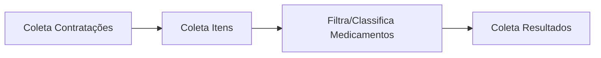

# Cesta de preços - coletores

[](LICENSE)
[](https://www.python.org/downloads/release/python-380/)
[](https://cran.r-project.org/bin/windows/base/old/4.0.0/)

Este repositório comporta processamento dos dados de contratações do PNCP para uso em uma aplicação de cesta de preços.

## Replicação

### COLETORES (`/src/ETL`)

#### Coleta, filtragem e classificação de contratações de medicamentos no PNCP

* O script `run-coletores.sh` gerencia a execução dos scripts de coleta e classificação de dados das APIs do PNCP, localizados em `src/ETL/coletores` e `src/ETL/classificador`. Recebe como parâmetros a data de início, fim e um *alias* para o subdiretório de saída. As etapas são:

  1. **Coleta de contratações**: Realizada pelo script `src/ETL/coletores/coleta-contratacoes.R`, gerenciado por `coletor-contratacoes.sh`, que recebe como parâmetros a data de início, fim e um *alias* para o subdiretório de saída.

  2. **Coleta de itens contratados**: Realizada pelo script `src/ETL/coletores/coleta-itens-contratacoes.R`, gerenciado por `coletor-itens-contratacoes.sh`, com os mesmos parâmetros de data e *alias*.

  3. **Filtragem e classificação de medicamentos**: Realizada pelo script `src/ETL/classificador/classifica-medicamentos.R`, gerenciado por `classificador.sh`, também utilizando os parâmetros de data e *alias*. Os resultados das filtragens de medicamentos são salvos junto com seus embeddings no mesmo diretório de itens em um arquivo CSV chamado `medicamentos.csv`.

  4. **Resultado das contratações de medicamentos**: Realizada pelo script `src/ETL/coletores/coleta-resultados.R`, gerenciado por `rsc/ETL/coletor-resultados.sh`, com os mesmos parâmetros de data e *alias*.

##### Fluxograma do pipeline de coleta



##### Exemplo de execução

```bash
cd src/ETL
./run-coletores.sh "2025-01-Q1" "2025-01-01" "2025-01-15" | tee run-coletores-2025-01-Q1.log
```

* PARÂMETROS:
  * `2025-01-Q1`: *Alias* para o subdiretório onde os dados e o arquivo de log serão salvos.
  * `2025-01-01`: Data de início da coleta (padrão AAAA-MM-DD).
  * `2025-01-15`: Data de fim da coleta (padrão AAAA-MM-DD).
  * `run-coletores-2025-01-Q1.log`: Arquivo de log que armazenará todas as mensagens de saída e erros gerados durante a execução do script.

***

## Responsáveis

* [Luiz Fonseca](https://github.com/fonluiz)
* [Raul Durlo](https://github.com/rdurl0)
* [Talita Lôbo](https://github.com/talitalobo)

[](https://www.transparencia.org.br/)

[](https://creativecommons.org/licenses/by/4.0/)
