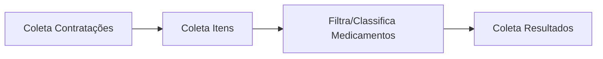

# Cesta de preços - coletores

[](LICENSE)
[](https://www.python.org/downloads/release/python-380/)
[](https://cran.r-project.org/bin/windows/base/old/4.0.0/)

Este repositório comporta processamento dos dados de contratações do PNCP para uso em uma aplicação de cesta de preços.

## Replicação

### COLETORES (`/src/ETL`)

#### Coleta, filtragem e classificação de contratações de medicamentos no PNCP

- O script `run-coletores.sh` gerencia a execução dos scripts de coleta e classificação de dados das APIs do PNCP, localizados em `src/ETL/coletores` e `src/ETL/classificador`. Recebe como parâmetros a data de início, fim e um _alias_ para o subdiretório de saída. As etapas são:



---

<br>

| Descrição                                                                                           | Script                        | Gerenciador                     | Parâmetros                     |
| --------------------------------------------------------------------------------------------------- | ----------------------------- | ------------------------------- | ------------------------------ |
| 1. Coleta de contratações — coleta dados de contratações no PNCP                                    | `coleta-contratacoes.R`       | `coletor-contratacoes.sh`       | Data início, Data fim, _alias_ |
| 2. Coleta de itens contratados — coleta itens das contratações                                      | `coleta-itens-contratacoes.R` | `coletor-itens-contratacoes.sh` | Data início, Data fim, _alias_ |
| 3. Filtragem e classificação de medicamentos — filtra e classifica medicamentos, gerando embeddings | `classifica-medicamentos.R`   | `classificador.sh`              | Data início, Data fim, _alias_ |
| 4. Resultado das contratações de medicamentos — coleta resultados das contratações de medicamentos  | `coleta-resultados.R`         | `coletor-resultados.sh`         | Data início, Data fim, _alias_ |

---

- _Alias_ é um subdiretório onde os dados e o arquivo de log serão salvos.
- Data de início da coleta (padrão AAAA-MM-DD).
- Data de fim da coleta (padrão AAAA-MM-DD).

##### Exemplo de execução

```bash
cd src/ETL
./run-coletores.sh "2025-01/QUINZENA-1" "2025-01-01" "2025-01-15" | tee run-coletores-2025-01-QUINZENA-1.log
```

- PARÂMETROS:
  - `2025-01-Q1`: _Alias_ para o subdiretório onde os dados e o arquivo de log serão salvos.
  - `2025-01-01`: Data de início da coleta (padrão AAAA-MM-DD).
  - `2025-01-15`: Data de fim da coleta (padrão AAAA-MM-DD).
  - `run-coletores-2025-01-Q1.log`: Arquivo de log que armazenará todas as mensagens de saída e erros gerados durante a execução do script.

---

## Responsáveis

- [Luiz Fonseca](https://github.com/fonluiz)
- [Raul Durlo](https://github.com/rdurl0)
- [Talita Lôbo](https://github.com/talitalobo)

[](https://www.transparencia.org.br/)<br>

[](https://www.open-contracting.org/)<br>

[](https://medicamentos.transparencia.org.br/)
<br>
[](https://creativecommons.org/licenses/by/4.0/)
