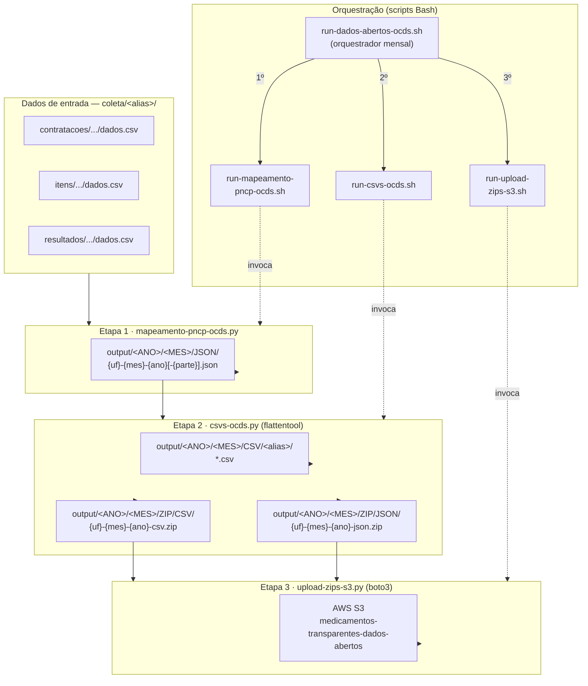

# Mapeamento PNCP → OCDS

Esta task converte dados de contratações do PNCP para o padrão [OCDS](https://standard.open-contracting.org/), gera CSVs/ZIPs a partir dos JSONs produzidos e transfere os artefatos para o AWS S3.

## Fluxo de dados



## Scripts Bash — orquestração

Os scripts `.sh` residem em `src/` e são a camada de entrada do pipeline. Todos validam `ANO` e `MES` antes de chamar os scripts Python, e gravam logs em `output/LOGS/`.

| Script | Modo | Responsabilidade |
| --- | --- | --- |
| `run-dados-abertos-ocds.sh` | **Orquestrador** | Aceita `--ano`/`--mes` por flag ou interativamente. Executa as três etapas em sequência; com `--smoke-test`, roda apenas mapeamento e CSVs/ZIPs locais. **Use este para o pipeline completo.** |
| `run-mapeamento-pncp-ocds.sh` | Runner individual | Solicita `ANO` e `MES` via stdin, valida entradas e invoca `mapeamento-pncp-ocds.py`. |
| `run-csvs-ocds.sh` | Runner individual | Solicita `ANO` e `MES` via stdin, valida entradas e invoca `csvs-ocds.py` para gerar CSVs/ZIPs locais. Não executa upload para S3. |
| `run-upload-zips-s3.sh` | Runner individual | Solicita `ANO` e `MES` via stdin, carrega `.env` e invoca `upload-zips-s3.py`. Aceita `--overwrite`. |

## Estrutura de diretórios

```text
tasks/mapeamento-ocds/
├── src/
│   ├── run-dados-abertos-ocds.sh      # Orquestrador mensal: mapeamento + CSVs/ZIPs + upload
│   ├── run-mapeamento-pncp-ocds.sh    # Runner interativo do mapeamento
│   ├── run-csvs-ocds.sh               # Runner interativo da geração de CSVs/ZIPs
│   ├── run-upload-zips-s3.sh          # Runner interativo do upload para S3
│   ├── mapeamento-pncp-ocds.py       # Script Python: mapeamento PNCP → JSON OCDS
│   ├── csvs-ocds.py                   # Script Python: JSON OCDS → CSVs/ZIPs
│   └── upload-zips-s3.py              # Script Python: ZIPs locais → AWS S3
├── output/
│   ├── LOGS/                          # Logs de execução
│   └── <ANO>/<MES>/
│       ├── JSON/                      # JSONs OCDS gerados pelo mapeamento
│       ├── CSV/                       # CSVs gerados pelo flattentool
│       └── ZIP/
│           ├── CSV/                   # ZIPs com os CSVs agrupados por UF
│           └── JSON/                  # ZIPs com os JSONs agrupados por UF
└── README.md
```

## Pré-requisitos

- **Python** com ambiente virtual (`.venv`) configurado na raiz do repositório.
- Pacotes Python: `sentence-transformers`, `pandas`, `flattentool`, `boto3`, entre outros (ver `requirements.txt`).
- **WSL** (se estiver no Windows): os scripts `.sh` devem ser executados no terminal WSL.
- **Credenciais AWS** configuradas via `.env`, variáveis de ambiente ou profile local.

Exemplo de `.env`:

```bash
AWS_REGION=us-east-1
AWS_ACCESS_KEY_ID=CHANGE_ME
AWS_SECRET_ACCESS_KEY=CHANGE_ME
# AWS_SESSION_TOKEN=CHANGE_ME
# AWS_PROFILE=default

AWS_S3_BUCKET=medicamentos-transparentes-dados-abertos
MAPEAMENTO_OCDS_OUTPUT_DIR=tasks/mapeamento-ocds/output
```

## Fluxo recomendado — Pipeline mensal completo

Use o orquestrador `run-dados-abertos-ocds.sh` para informar `ANO` e `MES` uma única vez e executar o fluxo completo: mapeamento PNCP → JSON OCDS, geração de CSVs/ZIPs e upload dos ZIPs para S3.

```bash
bash tasks/mapeamento-ocds/src/run-dados-abertos-ocds.sh --ano 2026 --mes 3 2>&1 | tee tasks/mapeamento-ocds/output/LOGS/run-dados-abertos-ocds-2026-03.log
```

Por padrão, o upload para S3 não sobrescreve objetos já existentes. Para substituir arquivos remotos com a mesma chave, use `--overwrite` explicitamente:

```bash
bash tasks/mapeamento-ocds/src/run-dados-abertos-ocds.sh --ano 2026 --mes 3 --overwrite
```

### Execução em lote com sobrescrita remota

O exemplo abaixo roda o pipeline completo para todos os meses de 2025 e para janeiro a junho de 2026, sobrescrevendo os ZIPs existentes no bucket S3. Cada etapa mantém seus logs mensais em `tasks/mapeamento-ocds/output/LOGS/`, e o loop também grava um log mestre da execução em lote.

```bash
# Se estiver usando WSL, exporte as variáveis primeiro:
export WSLENV=ANO:MES:$WSLENV

mkdir -p tasks/mapeamento-ocds/output/LOGS
BATCH_LOG="tasks/mapeamento-ocds/output/LOGS/pipeline-overwrite-s3-2025-2026-$(date +%Y%m%d-%H%M%S).log"

for ANO in 2025 2026; do
  if [[ "$ANO" == "2025" ]]; then
    MESES=$(seq 1 12)
  else
    MESES=$(seq 1 4)
  fi

  for MES in $MESES; do
    bash tasks/mapeamento-ocds/src/run-dados-abertos-ocds.sh \
      --ano "$ANO" \
      --mes "$MES" \
      --overwrite 2>&1 | tee -a "$BATCH_LOG"
  done
done
```

### Smoke test local sem upload

Use `--smoke-test` para rodar a etapa 1 e a etapa 2, gerar os pacotes localmente e pular completamente o upload para S3. Esse modo não cria cliente S3, não chama `upload-zips-s3.py` e não afeta o armazenamento remoto.

```bash
# Se estiver usando WSL, exporte as variáveis primeiro:
export WSLENV=ANO:MES:$WSLENV

bash tasks/mapeamento-ocds/src/run-dados-abertos-ocds.sh --ano 2026 --mes 6 --smoke-test
```

Os artefatos gerados ficam em `tasks/mapeamento-ocds/output/<ANO>/<MES>/` e ficam prontos para inspeção local.

Os runners individuais abaixo continuam disponíveis para executar etapas isoladas.

## Etapa 1 — Mapeamento PNCP → JSON OCDS

Converte os dados de contratações do PNCP em JSONs no formato OCDS. O script solicita ANO e MES interativamente e grava o log automaticamente:

```bash
bash tasks/mapeamento-ocds/src/run-mapeamento-pncp-ocds.sh
```

## Etapa 2 — Geração de CSVs/ZIPs a partir dos JSONs OCDS

Após o mapeamento, este passo usa o `flattentool` para achatar os JSONs em CSVs e compactá-los em ZIPs. O script solicita ANO e MES interativamente e não executa upload para S3:

```bash
bash tasks/mapeamento-ocds/src/run-csvs-ocds.sh
```

Para enviar os ZIPs ao S3 depois da geração local, execute a etapa 3 com `run-upload-zips-s3.sh` ou use o orquestrador `run-dados-abertos-ocds.sh` no fluxo completo.

### Parâmetros do `csvs-ocds.py`

| Parâmetro             | Obrigatório | Descrição                                               |
| --------------------- | ----------- | ------------------------------------------------------- |
| `--ano`               | Sim         | Ano dos dados a processar.                              |
| `--mes`               | Não         | Mês (1-12). Se omitido, processa todos os meses do ano. |
| `--base-dir`          | Não         | Raiz do repositório (detectado automaticamente).        |
| `--aliases`           | Não         | Lista de aliases específicos para processar.            |
| `--limit`             | Não         | Limita a N JSONs (útil para testes).                    |
| `--skip-existing-zip` | Não         | Pula grupos cujo ZIP já existe.                         |

## Etapa 3 — Transferência dos ZIPs para AWS S3

Após o mapeamento e a geração de CSVs/ZIPs, este passo valida os diretórios `ZIP/CSV` e `ZIP/JSON` e envia os arquivos `.zip` para o bucket `medicamentos-transparentes-dados-abertos`.

Os objetos são enviados sem subdiretórios no bucket, preservando exatamente o nome do arquivo local. Por padrão, se o objeto já existir no S3, o upload é pulado e o aviso fica registrado no log. Para substituir objetos existentes no bucket, passe `--overwrite` explicitamente.

### Parâmetros do `upload-zips-s3.py`

| Parâmetro     | Obrigatório | Descrição                                                |
| ------------- | ----------- | -------------------------------------------------------- |
| `--ano`       | Sim         | Ano dos ZIPs a transferir.                               |
| `--mes`       | Não         | Mês (1-12). Se omitido, processa todos os meses do ano.  |
| `--base-dir`  | Não         | Raiz do repositório (detectado automaticamente).         |
| `--bucket`    | Não         | Bucket S3 de destino; default via `.env` ou padrão fixo. |
| `--env-file`  | Não         | Arquivo `.env` alternativo.                              |
| `--overwrite` | Não         | Sobrescreve objetos existentes no bucket S3.             |
