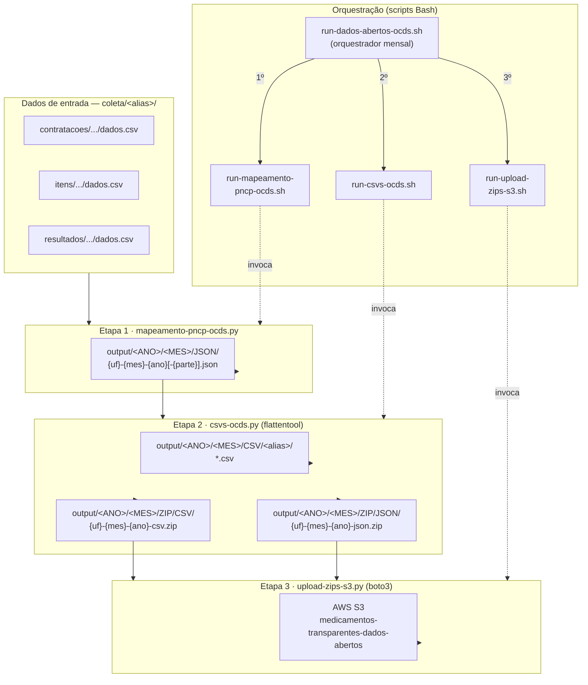

# Mapeamento PNCP → OCDS

Esta task converte dados de contratações do PNCP para o padrão [OCDS](https://standard.open-contracting.org/), gera CSVs/ZIPs a partir dos JSONs produzidos e transfere os artefatos para o AWS S3.

## Fluxo de dados



## Scripts Bash — orquestração

Os scripts `.sh` residem em `src/` e são a camada de entrada do pipeline. Todos validam `ANO` e `MES` antes de chamar os scripts Python, e gravam logs em `output/LOGS/`.

| Script | Modo | Responsabilidade |
|---|---|---|
| `run-dados-abertos-ocds.sh` | **Orquestrador** | Aceita `--ano`/`--mes` por flag ou interativamente. Executa as três etapas em sequência, com log unificado. **Use este para o pipeline completo.** |
| `run-mapeamento-pncp-ocds.sh` | Runner individual | Solicita `ANO` e `MES` via stdin, valida entradas e invoca `mapeamento-pncp-ocds.py`. |
| `run-csvs-ocds.sh` | Runner individual | Solicita `ANO` e `MES` via stdin, invoca `csvs-ocds.py` e, ao final, chama o upload para S3. |
| `run-upload-zips-s3.sh` | Runner individual | Solicita `ANO` e `MES` via stdin, carrega `.env` e invoca `upload-zips-s3.py`. |

> **Atenção:** `run-csvs-ocds.sh` já aciona o upload ao término. Se você chamar os runners individuais em sequência, o upload será executado duas vezes. Para evitar duplicação, use o orquestrador `run-dados-abertos-ocds.sh`.

## Estrutura de diretórios

```
tasks/mapeamento-ocds/
├── src/
│   ├── run-dados-abertos-ocds.sh      # Orquestrador mensal: mapeamento + CSVs/ZIPs + upload
│   ├── run-mapeamento-pncp-ocds.sh    # Runner interativo do mapeamento
│   ├── run-csvs-ocds.sh               # Runner interativo da geração de CSVs + upload
│   ├── run-upload-zips-s3.sh          # Runner interativo do upload para S3
│   ├── mapeamento-pncp-ocds.py       # Script Python: mapeamento PNCP → JSON OCDS
│   ├── csvs-ocds.py                   # Script Python: JSON OCDS → CSVs/ZIPs
│   └── upload-zips-s3.py              # Script Python: ZIPs locais → AWS S3
├── output/
│   ├── LOGS/                          # Logs de execução
│   └── <ANO>/<MES>/
│       ├── JSON/                      # JSONs OCDS gerados pelo mapeamento
│       ├── CSV/                       # CSVs gerados pelo flattentool
│       └── ZIP/
│           ├── CSV/                   # ZIPs com os CSVs agrupados por UF
│           └── JSON/                  # ZIPs com os JSONs agrupados por UF
└── README.md
```

## Pré-requisitos

- **Python** com ambiente virtual (`.venv`) configurado na raiz do repositório.
- Pacotes Python: `sentence-transformers`, `pandas`, `flattentool`, `boto3`, entre outros (ver `requirements.txt`).
- **WSL** (se estiver no Windows): os scripts `.sh` devem ser executados no terminal WSL.
- **Credenciais AWS** configuradas via `.env`, variáveis de ambiente ou profile local.

Exemplo de `.env`:

```bash
AWS_REGION=us-east-1
AWS_ACCESS_KEY_ID=CHANGE_ME
AWS_SECRET_ACCESS_KEY=CHANGE_ME
# AWS_SESSION_TOKEN=CHANGE_ME
# AWS_PROFILE=default

AWS_S3_BUCKET=medicamentos-transparentes-dados-abertos
MAPEAMENTO_OCDS_OUTPUT_DIR=tasks/mapeamento-ocds/output
```

## Fluxo recomendado — Pipeline mensal completo

Use o orquestrador `run-dados-abertos-ocds.sh` para informar `ANO` e `MES` uma única vez e executar o fluxo completo: mapeamento PNCP → JSON OCDS, geração de CSVs/ZIPs e upload dos ZIPs para S3.

```bash
bash tasks/mapeamento-ocds/src/run-dados-abertos-ocds.sh
```

Também é possível passar o período por flags:

```bash
bash tasks/mapeamento-ocds/src/run-dados-abertos-ocds.sh --ano 2026 --mes 3 2>&1 | tee tasks/mapeamento-ocds/output/LOGS/run-dados-abertos-ocds-2026-03.log
```

Os runners individuais abaixo continuam disponíveis para executar etapas isoladas.

## Etapa 1 — Mapeamento PNCP → JSON OCDS

Converte os dados de contratações do PNCP em JSONs no formato OCDS.

### Via script interativo (recomendado)

O script solicita ANO e MES interativamente e grava o log automaticamente:

```bash
bash tasks/mapeamento-ocds/src/run-mapeamento-pncp-ocds.sh
```

### Via linha de comando direta

```bash
# Se estiver usando WSL, exporte as variáveis primeiro:
export WSLENV=ANO:MES:$WSLENV

# Execução para um mês específico (ex.: março de 2026)
ANO=2026 MES=3; MES_PAD=$(printf "%02d" "$MES"); \
  mkdir -p tasks/mapeamento-ocds/output/LOGS && \
  ANO=$ANO MES=$MES ./.venv/Scripts/python.exe tasks/mapeamento-ocds/src/mapeamento-pncp-ocds.py \
  2>&1 | tee -a "tasks/mapeamento-ocds/output/LOGS/mapeamento-${ANO}-${MES_PAD}.log"
```

### Execução em lote (vários meses)

```bash
export WSLENV=ANO:MES:$WSLENV

for MES in {1..9}; do
  MES_PAD=$(printf "%02d" "$MES")
  LOG="tasks/mapeamento-ocds/output/LOGS/mapeamento-2025-${MES_PAD}.log"
  {
    echo "==== Início ANO=2025 MES=${MES} $(date -Iseconds) ===="
    ANO=2025 MES=$MES ./.venv/Scripts/python.exe tasks/mapeamento-ocds/src/mapeamento-pncp-ocds.py
    echo "==== Fim MES=${MES} $(date -Iseconds) ===="
    echo
  } 2>&1 | tee -a "$LOG"
done
```

## Etapa 2 — Geração de CSVs/ZIPs a partir dos JSONs OCDS

Após o mapeamento, este passo usa o `flattentool` para achatar os JSONs em CSVs e compactá-los em ZIPs.

### Via script interativo (recomendado)

O script solicita ANO e MES interativamente:

```bash
bash tasks/mapeamento-ocds/src/run-csvs-ocds.sh
```

Ao final da geração dos CSVs/ZIPs, o runner chama automaticamente a transferência dos ZIPs para o S3.

### Via linha de comando direta

```bash
# Março de 2026
ANO=2026 MES=3; MES_PAD=$(printf "%02d" "$MES"); \
  mkdir -p tasks/mapeamento-ocds/output/LOGS && \
  ./.venv/Scripts/python.exe tasks/mapeamento-ocds/src/csvs-ocds.py --ano "$ANO" --mes "$MES" \
  2>&1 | tee "tasks/mapeamento-ocds/output/LOGS/csvs-ocds-${ANO}-${MES_PAD}.log"
```

```bash
# Todos os meses de 2025
./.venv/Scripts/python.exe tasks/mapeamento-ocds/src/csvs-ocds.py --ano 2025

# Smoke test (limitar a 3 JSONs)
./.venv/Scripts/python.exe tasks/mapeamento-ocds/src/csvs-ocds.py --ano 2026 --mes 1 --limit 3

# Pular grupos já processados
./.venv/Scripts/python.exe tasks/mapeamento-ocds/src/csvs-ocds.py --ano 2026 --mes 1 --skip-existing-zip
```

### Parâmetros do `csvs-ocds.py`

| Parâmetro             | Obrigatório | Descrição                                               |
| --------------------- | ----------- | ------------------------------------------------------- |
| `--ano`               | Sim         | Ano dos dados a processar.                              |
| `--mes`               | Não         | Mês (1-12). Se omitido, processa todos os meses do ano. |
| `--base-dir`          | Não         | Raiz do repositório (detectado automaticamente).        |
| `--aliases`           | Não         | Lista de aliases específicos para processar.            |
| `--limit`             | Não         | Limita a N JSONs (útil para testes).                    |
| `--skip-existing-zip` | Não         | Pula grupos cujo ZIP já existe.                         |

## Etapa 3 — Transferência dos ZIPs para AWS S3

Após o mapeamento e a geração de CSVs/ZIPs, este passo valida os diretórios `ZIP/CSV` e `ZIP/JSON` e envia os arquivos `.zip` para o bucket `medicamentos-transparentes-dados-abertos`.

Os objetos são enviados sem subdiretórios no bucket, preservando exatamente o nome do arquivo local. Se o objeto já existir, o upload é pulado e o aviso fica registrado no log.

### Via script interativo

```bash
bash tasks/mapeamento-ocds/src/run-upload-zips-s3.sh
```

### Via linha de comando direta

```bash
./.venv/Scripts/python.exe tasks/mapeamento-ocds/src/upload-zips-s3.py --ano 2026 --mes 1
```

### Parâmetros do `upload-zips-s3.py`

| Parâmetro    | Obrigatório | Descrição                                                |
| ------------ | ----------- | -------------------------------------------------------- |
| `--ano`      | Sim         | Ano dos ZIPs a transferir.                               |
| `--mes`      | Não         | Mês (1-12). Se omitido, processa todos os meses do ano.  |
| `--base-dir` | Não         | Raiz do repositório (detectado automaticamente).         |
| `--bucket`   | Não         | Bucket S3 de destino; default via `.env` ou padrão fixo. |
| `--env-file` | Não         | Arquivo `.env` alternativo.                              |
